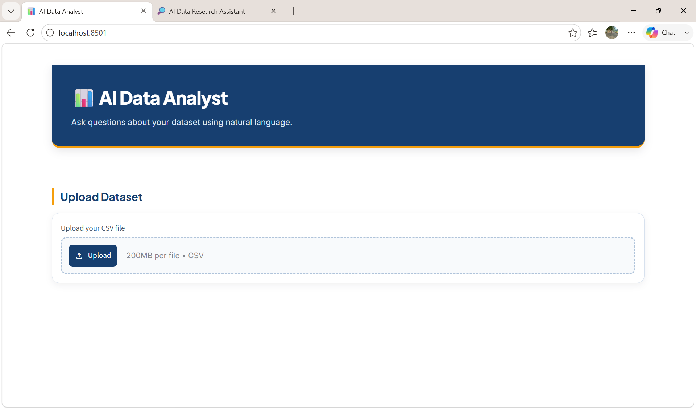
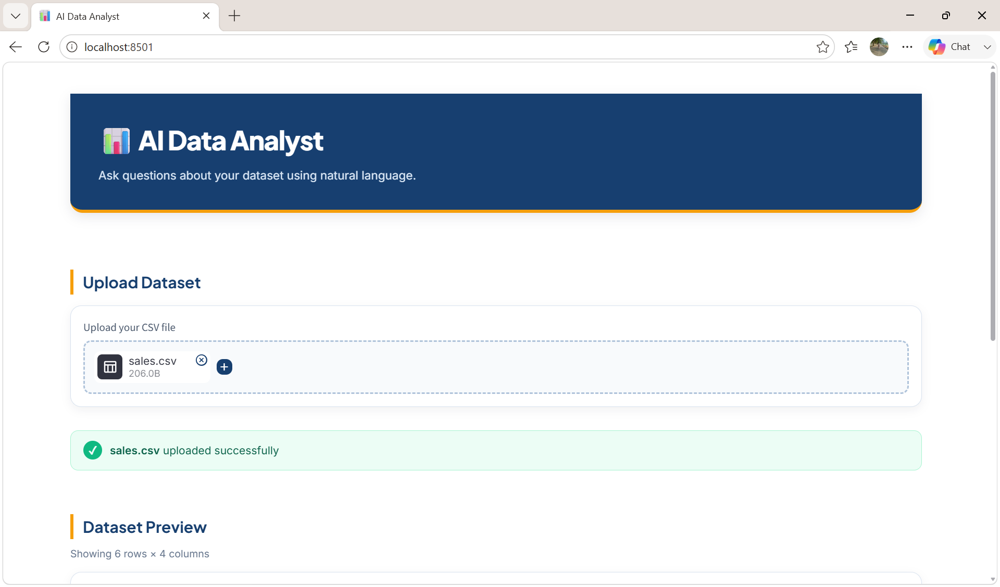
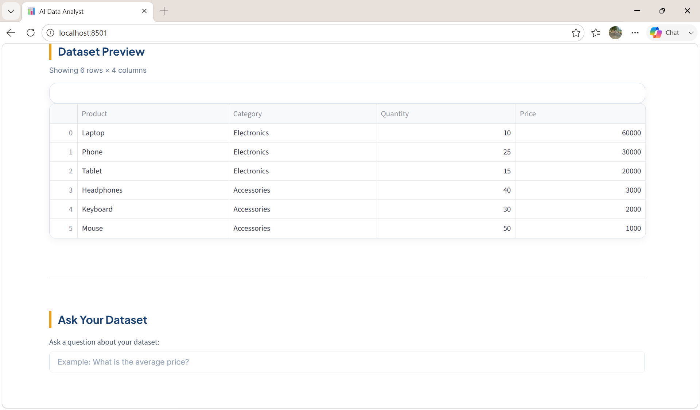
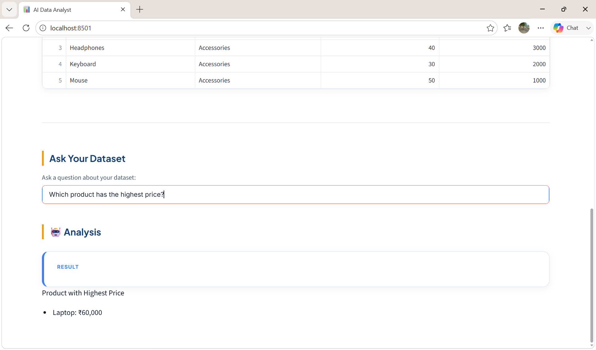

# 🤖 AI Data Analyst

An AI-powered data analysis application that allows users to upload CSV datasets and ask questions about their data using natural language.

The application uses an AI agent to understand the user's question, select the appropriate analysis tool, process the data using Python and Pandas, and return a clear analysis result.

This project demonstrates the integration of **AI agents, tool calling, data analysis, and Streamlit** to create a natural-language interface for working with structured datasets.

## ✨ Key Features

- 📂 **CSV Dataset Upload**  
  Upload a CSV file directly through the Streamlit interface.

- 💬 **Natural Language Data Queries**  
  Ask questions about the dataset using normal English instead of writing Pandas code.

- 🤖 **AI-Powered Agent**  
  The AI agent understands the user's question and determines which analysis tool should be used.

- 🛠️ **Tool-Based Data Analysis**  
  Different analysis tools handle different types of data questions.

- 👥 **Customer Analysis**  
  Analyze customer-related information and identify highest or lowest values.

- 👨‍💼 **Employee Analysis**  
  Analyze employee data, including salary-related questions.

- 🛍️ **Product Analysis**  
  Analyze products based on price, quantity, and revenue.

- 💰 **Revenue Analysis**  
  Calculate revenue using product quantity and price and analyze revenue by product or category.

- 🔎 **Highest and Lowest Analysis**  
  Identify products, customers, or employees with the highest or lowest values.

- 🖥️ **Interactive Streamlit Interface**  
  View the uploaded dataset and analysis results through a simple web interface.

## 🧠 How the Application Works

The application follows an AI-agent-based workflow to convert natural-language questions into data analysis.

User
  ↓
Streamlit Interface
  ↓
Upload CSV Dataset
  ↓
Ask Question in Natural Language
  ↓
AI Agent
  ↓
Select Appropriate Analysis Tool
  ↓
Pandas Data Analysis
  ↓
Analysis Result
  ↓
Clear Answer in Dashboard

## 🔄 Application Workflow

The application processes a user's natural-language question through the following workflow:

CSV Upload
    ↓
Dataset Path
    ↓
User Question
    ↓
AI Agent
    ↓
Tool Selection
    ↓
Analysis Tool
    ↓
Pandas Data Processing
    ↓
Tool Result
    ↓
AI Agent
    ↓
Final Answer Generation
    ↓
Streamlit Dashboard

## 🛠️ Technologies Used

- **Python** – Core programming language
- **Pandas** – Data processing and analysis
- **Streamlit** – Interactive web application interface
- **LangChain** – LLM and tool integration
- **LangGraph** – AI agent workflow orchestration
- **Ollama** – Local Large Language Model execution
- **Pydantic** – Data validation and structured data handling
- **uv** – Python package and environment management

## 📁 Project Structure

AI-DS-Analyst/
│
├── app.py
├── README.md
├── pyproject.toml
├── uv.lock
├── .gitignore
│
├── data/
│   ├── sales.csv
│   ├── employees.csv
│   └── customers.csv
│
├── src/
│   └── ai_ds_analyst/
│       ├── __init__.py
│       ├── agent_graph.py
│       ├── state.py
│       ├── tools.py
│       └── agent_test.py
│
└── tests/

### Project Components

- `app.py` – Streamlit application and user interface.
- `agent_graph.py` – Defines the AI agent and LangGraph workflow.
- `tools.py` – Contains the data analysis tools.
- `state.py` – Defines the state used by the agent workflow.
- `agent_test.py` – Used for testing the agent workflow.
- `data/` – Contains sample CSV datasets for testing.
- `tests/` – Contains project tests.
- `pyproject.toml` – Project configuration and dependencies.
- `uv.lock` – Locks the project dependencies.
- `.gitignore` – Specifies files that should not be committed to Git.

## 💬 Supported Questions

The AI Data Analyst can answer natural-language questions such as:

### 📊 Dataset Analysis

- How many rows and columns are in the dataset?
- What are the columns in the dataset?
- Give me an overview of the dataset.
- What are the key insights from this dataset?

### 💰 Revenue Analysis

- What is the total revenue?
- What is the total revenue by category?
- What is the total revenue by product?

### 🛍️ Product Analysis

- Which product has the highest revenue?
- Which product has the lowest revenue?
- Which product has the highest price?
- Which product has the lowest price?
- Which product has the highest quantity?
- Which product has the lowest quantity?

### 👨‍💼 Employee Analysis

- What is the average salary?
- Who has the highest salary?
- Who has the lowest salary?
- What is the average salary by department?

### 👥 Customer Analysis

- Which customer has the highest purchase amount?
- Which customer has the lowest purchase amount?

### 🔀 Multi-Part Questions

The agent can also handle questions containing multiple analysis tasks.

Example:

> "What is the total revenue by category and which product has the highest price?"

The agent identifies the two tasks, selects the required tools, performs both analyses, and returns the combined result.

## 📸 Screenshots

### AI Data Analyst Dashboard



### Dataset Upload



### Dataset Preview



### Analysis Output



## ⚙️ Installation & Setup

### 1. Clone the Repository

```bash
git clone <your-github-repository-url>
cd AI-DS-Analyst

### 2. Install Dependencies

```bash
uv sync

### 3. Set Up Ollama

Make sure Ollama is installed and running on your system.

Pull the required model:

```bash
ollama pull llama3.2

### 4. Run the Application

```bash
uv run streamlit run app.py

## 🧪 Testing

Run the project tests using:

```bash
uv run pytest
```

## 🚀 Future Improvements

- Add data visualization and interactive charts.
- Support additional dataset formats.
- Add advanced statistical analysis.
- Generate downloadable analysis reports.
- Improve AI-powered data insights.

## 👤 Author

Anto Jovita J

